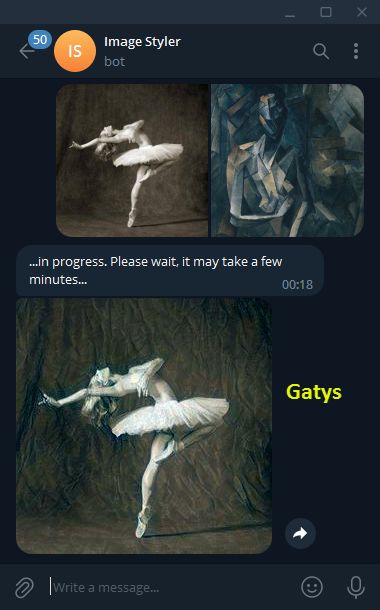
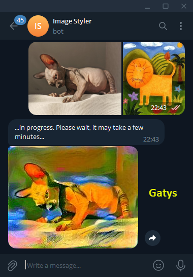
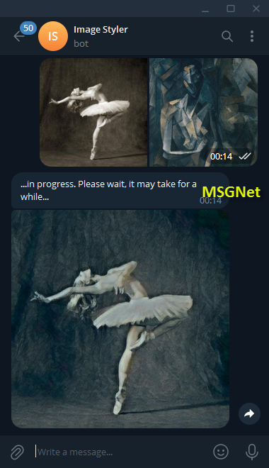
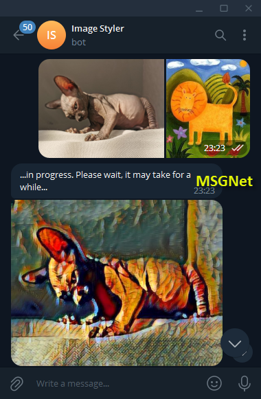
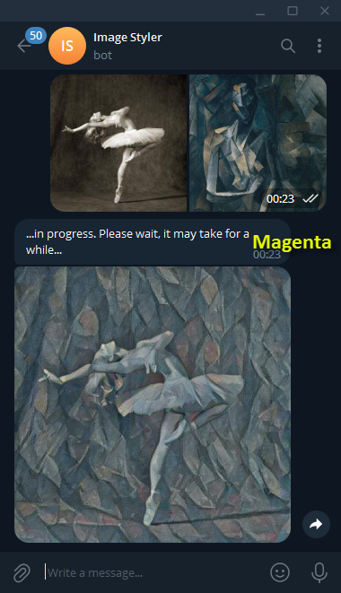
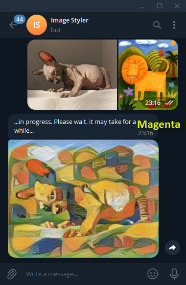
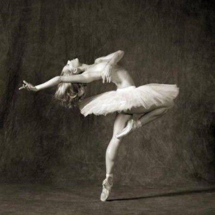
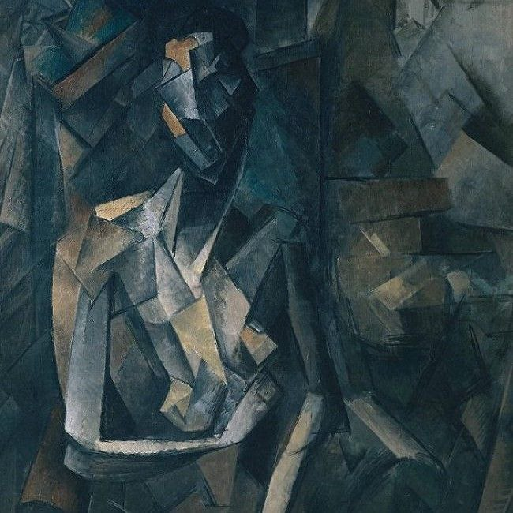
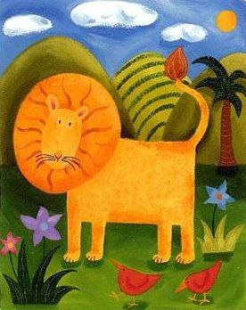
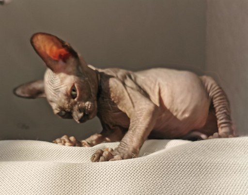

## The final project for the course "Deep Learning"
### Semester 1, autumn 2022 - https://stepik.org/course/124070/info
#### Participant: Andrei Polkanov

# Telegram Bots - Styling images in a telegram bot

## Task:
```
Main part (one of two options):

Option 1:
- Write code for a simple model that can transfer style from one photo to another.
    You can use the slow algorithm that we talked about in our lesson.
- Make a bot that you can send two photos to and get a photo with the transferred style in return.

Additional part for option 1:
- Add the ability to transfer style using GANs.

Option 2:
- Write a code that improves the quality of a photo using GANs 
    (you can narrow the selection to some objects of the same type)
- Make a bot to which you can send a photo and receive a photo with improved quality in response

Additional part for option 2:
- Add the ability to improve the quality of photos of different objects (i.e. not of the same type)

Requirements: https://periwinkle-wedge-678.notion.site/tg-bots-project-4f57c3d7a8754b6d94622ebf1993a603
```
##### Requirements: https://periwinkle-wedge-678.notion.site/tg-bots-project-4f57c3d7a8754b6d94622ebf1993a603

## About the project
I implemented a telegram bot which gets 2 images from a user, uses them as a content and a style for generating a new one, then sends the result image back to the user.

Users can send those 2 images one after another or together. The order of sent images is meaningful - the first one is a content and the second one is a style. For example, the first image - a photo of your beloved dog or cat, the second one - an artwork of Picasso, and the result image will be a photo of your dog or cat as kind of artwork in the style of Picasso.

### How to
It’s an educational project, but it’s in production-ready state - you can deploy it on a local machine or your web server, register your own telegram bot and receive the token (https://core.telegram.org/bots/features#botfather), create a `token.txt` file and copy the token there, and put the file to the project root folder. File `requirements.txt` contains info about using packages you need to install to your environment.

Start the application by the `python -m imgstyler_bot` command in the terminal (you need to set `source` folder as a current dir in the terminal). Then you can go to the Telegram, find your bot and start an interaction with it.

### Structure
- `notebook` - this folder contains Jupyter notebooks with the `MSGNet` model training process;
  - `images` - these images (in sub-folders) are necessary for training `MSGNet` model;
- `pic` - contains images for README.md;
- `source`- the main development folder, the root of application code;
  - `styletransfer` - the package with different style transfers;
    - `gatys` - described below;
    - `magenta` - described below;
    - `msgnet` - described below;
    - `styletransfer.py` - contains base classes for all style transfers. You can add your own style transfers simply by inheriting their classes from the base ones;
    - `torchdevice.py` - just small util;
  - `imgstyler_bot.py` - the main application module, entry point for the application;
  - `test_.py` - unit tests on `pytest` framework - https://docs.pytest.org/en/latest/;
- `requirements.txt` - configuration of needed packages
- `token.txt` - !!! you should put your own token on this level alongside of `source` folder !!!;

### Style Transfer
The bot now supports 4 algorithms that can be used for styling images:

- #### Gatys
	https://arxiv.org/abs/1508.06576

	https://pytorch.org/tutorials/advanced/neural_style_tutorial.html

	`Gatys` is the classic, which gave a tangible impetus to the development of style transfer at its time. Great work! And it gives excellent results. But it’s slow - on my laptop the computations sometimes took up to several minutes. Anyway, it must have to be studied deeply for educational purposes.

	 

- #### MSGNet
	https://arxiv.org/abs/1703.06953

	https://github.com/zhanghang1989/PyTorch-Multi-Style-Transfer

	https://github.com/zhanghang1989/PyTorch-Multi-Style-Transfer/blob/master/msgnet.ipynb

	`MSGNet` is the fastest on my laptop and somtimes gives interest results, but it's also often makes some visible "brush"-patterns or fails with colors.

	 

- #### Magenta
	https://arxiv.org/abs/1705.06830

	https://tfhub.dev/google/magenta/arbitrary-image-stylization-v1-256/2
	
	https://towardsdatascience.com/fast-neural-style-transfer-in-5-minutes-with-tensorflow-hub-magenta-110b60431dcc

	`Magenta` - fast enough, but a bit slower than `MSGNet` and also has its issues - tends to over-patternize the image.

	 

- #### MSGNetCustomTrain
	https://github.com/wolfhoundgelert/imgstyler_bot/tree/master/notebook

	https://github.com/zhanghang1989/PyTorch-Multi-Style-Transfer/blob/75d256049a6af7ceccae01bd5c472556478048ea/experiments/main.py#L108

	Dataset: http://images.cocodataset.org/zips/val2014.zip (I took a validation dataset, it’s 2 times smaller than the train one)

	`MSGNetCustomTrain` is my attempt at `MSGNet` training on my own, but my results weren't as good as the original ones because the training requires a lot of computational resources. You can find my adapted notebooks with my tries in the `notebook` folder, and turn it on with  style transfer type.

	TODO image TODO image

*It's not an easy walk to find some universal algorithm or neural network for any task and person - they all have their pros and cons. It's a matter of trading between speed, stability and subjective satisfaction.*

##### You can **switch the current algorithm** before running the bot in the main `imgstyler_bot.py` file:

	style_transfer_type = StyleTransferType.Gatys

### Telegram Bot

For the bot implementation I chose the `python-telegram-bot` library with new async API v.20.0:

https://github.com/python-telegram-bot/python-telegram-bot/wiki/Introduction-to-the-API

https://github.com/python-telegram-bot/python-telegram-bot/wiki/Extensions-%E2%80%93-Your-first-Bot

I also used some simple multiprocessing that allows my bot to process several requests simultaneously.

*I’m new in Python and neural networks, so please feel free to leave your comments on how it would be better to do something)*

### Artwork



I don't know the title and who the author is - I took this image from [this tutorial](https://pytorch.org/tutorials/advanced/neural_style_tutorial.html). If you know something about this amazing artwork, please let me know)



[Pablo Picasso, 1909-10, Figure dans un Fauteuil (Seated Nude, Femme nue assise)](https://en.wikipedia.org/wiki/File:Pablo_Picasso,_1909-10,_Figure_dans_un_Fauteuil_%28Seated_Nude,_Femme_nue_assise%29,_oil_on_canvas,_92.1_x_73_cm,_Tate_Modern,_London.jpg)



[Sophie Harding, Leo The Lion](https://www.sophie-harding.co.uk/wp-content/uploads/2015/03/Leo-The-Lion.jpg) - check out more of her adorable work on her website: https://www.sophie-harding.co.uk/



Not an artwork, but meet Chertik the cat - sponsor of today's review of neural networks)

:=+]